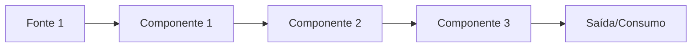
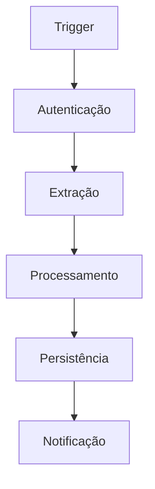

<!-- @kickoff-exclude -->

# TAP — Termo de Abertura do Projeto

> Template otimizado para alimentar o kickoff do template.
> Cada seção mapeia diretamente para grupos de placeholders `{{...}}`.
> O Apêndice B (Mapa de Extração) lista explicitamente: Placeholder -> Seção -> Valor.

---

## 0. Capa + Metadados

| Campo | Valor |
|-------|-------|
| **Projeto** | [Nome formal do projeto] |
| **Slug** | [nome-slug-para-paths] |
| **Tipo** | [automacao / api / cli / webapp / pipeline / outro] |
| **Organização** | [Nome da organização] |
| **Responsável** | [Nome do owner/responsável] |
| **Autor do documento** | [Nome do autor] |
| **Data** | [YYYY-MM-DD] |
| **E-mail de contato** | [email@exemplo.com] |
| **Status** | [Rascunho / Aprovado] |
| **Versão** | 1.0 |
| **Confidencialidade** | Uso interno — [Organização] |

**Placeholders alimentados:** `PROJECT_NAME`, `PROJECT_SLUG`, `PROJECT_TYPE`, `ORGANIZATION_NAME`, `RESPONSIBLE_NAME`, `AUTHOR_NAME`, `DATE`, `CONTACT_EMAIL`

---

## 1. Resumo Executivo

> Máximo 1 página. Problema, solução, valor.

### Problema (Dor)

[Descreva o problema central e por que importa — risco/impacto]

### Solução Proposta

- [Bullet 1: componente principal]
- [Bullet 2: mecanismo de valor]
- [Bullet 3: diferencial da abordagem]

### Valor Esperado

- [Redução de risco / eficiência / visibilidade]

### Dentro vs Fora do Escopo (Visão Macro)

- **Dentro:** [escopo MVP em 1-2 linhas]
- **Fora:** [o que fica para depois]

**Placeholders alimentados:** `PROJECT_CONTEXT`, `PROJECT_PROBLEM`, `PROJECT_SOLUTION`, `PROJECT_DESCRIPTION`

---

## 2. Contexto e Motivação

### Situação Atual ("Como é Hoje")

[Descreva o cenário atual — processos manuais, ferramentas usadas, limitações]

### Principais Dores

1. [Dor 1 — com exemplo prático]
2. [Dor 2 — com exemplo prático]
3. [Dor 3 — com exemplo prático]

### Consequências de Não Fazer

- **Operacional:** [risco]
- **Regulatório:** [risco]
- **Financeiro:** [risco]

**Placeholders alimentados:** Contexto narrativo para `documents/core/Projeto.md`

---

## 3. Objetivos e Critérios de Sucesso

### Objetivo Principal

[Uma frase clara e mensurável]

### Objetivos Específicos

1. [Objetivo específico 1]
2. [Objetivo específico 2]
3. [Objetivo específico 3]

### Critérios de Sucesso (Mensuráveis)

| Métrica | Baseline (Antes) | Meta (Depois) | Como Medir |
|---------|-------------------|---------------|------------|
| [Métrica 1] | [valor atual] | [valor esperado] | [fonte/frequência] |
| [Métrica 2] | [valor atual] | [valor esperado] | [fonte/frequência] |

**Placeholders alimentados:** `MAIN_OBJECTIVE`, `SPECIFIC_OBJECTIVE_1`, `SPECIFIC_OBJECTIVE_2`, `SPECIFIC_OBJECTIVE_3`, `VALUE_METRIC_1`, `VALUE_METRIC_2`

---

## 4. Escopo

### Dentro do Escopo (MVP)

1. [Funcionalidade 1]
2. [Funcionalidade 2]
3. [Funcionalidade 3]

### Fora do Escopo (Agora)

1. [Item 1 — justificativa breve]
2. [Item 2 — justificativa breve]

### Evoluções Previstas

1. [Expansão futura 1]
2. [Expansão futura 2]

### Dependências e Pré-Requisitos

- [Acessos, dados, permissões, pessoas]

**Placeholders alimentados:** `FUNCTIONAL_ITEM_1`, `FUNCTIONAL_ITEM_2`, `FUNCTIONAL_ITEM_3`, `OUT_OF_SCOPE_1`, `OUT_OF_SCOPE_2`, `FUTURE_EXPANSION_1`, `FUTURE_EXPANSION_2`

---

## 5. Stakeholders e RACI

| Papel | Quem | R/A/C/I | Responsabilidade |
|-------|------|---------|-----------------|
| Decisor | [Nome] | A | Aprovação final |
| Owner operacional | [Nome] | R | Uso diário |
| Fornecedor dados | [Nome/Sistema] | C | Credenciais e acessos |
| Informado | [Nome] | I | Recebe relatórios |

**Placeholders alimentados:** Contexto para `documents/core/Projeto.md` (seção Stakeholders)

---

## 6. Regras de Negócio Consolidadas

### Regras Validadas

| ID | Regra | Exemplo Prático | Status |
|----|-------|-----------------|--------|
| RN-01 | [Regra 1] | [Exemplo] | Confirmada |
| RN-02 | [Regra 2] | [Exemplo] | Confirmada |

### Casos de Borda / Exceções

- [Exceção 1 — como tratar]
- [Exceção 2 — como tratar]

### Pendências (A Confirmar)

- [ ] [Pergunta exata 1 — para qual stakeholder]
- [ ] [Pergunta exata 2 — para qual stakeholder]

**Placeholders alimentados:** `BUSINESS_RULE_1_NAME`, `BUSINESS_RULE_2_NAME`, regras detalhadas em `Projeto.md`

---

## 7. Dados e Fontes

### Entradas

| Fonte | Tipo | Frequência | Campos Principais |
|-------|------|------------|-------------------|
| [Sistema/API 1] | [API/arquivo/manual] | [diário/semanal] | [campos] |
| [Sistema/API 2] | [API/arquivo/manual] | [diário/semanal] | [campos] |

### Saídas

| Destino | Formato | Frequência |
|---------|---------|------------|
| [E-mail/Dashboard/DB] | [formato] | [frequência] |

### Infraestrutura Necessária

[Descreva requisitos de infra: servidores, cloud, storage, etc.]

### Dependências Críticas

1. [Dependência 1 — impacto se indisponível]
2. [Dependência 2 — impacto se indisponível]

**Placeholders alimentados:** `INFRA_DESCRIPTION`, `CRITICAL_DEPENDENCY_1`, `CRITICAL_DEPENDENCY_2`

---

## 8. Arquitetura e Fluxos

### Figura 1: Visão Alto Nível



<!-- Substituir pelo diagrama real. Usar paleta: laranja em acento, neutros claros em preenchimentos -->

### Figura 2: Fluxo Operacional Detalhado



<!-- Substituir pelo diagrama real -->

### Componentes Principais

| # | Componente | Responsabilidade |
|---|-----------|-----------------|
| 1 | [Componente 1] | [O que faz] |
| 2 | [Componente 2] | [O que faz] |
| 3 | [Componente 3] | [O que faz] |
| 4 | [Componente 4] | [O que faz] |

### Estrutura de Diretórios Proposta

```
src/
  [diretório_principal]/
    [subdiretório 1]/
    [subdiretório 2]/
tests/
  unit/
  integration/
```

### Scopes de Commit (Conventional Commits)

Baseados na arquitetura: `[scope1], [scope2], [scope3], [scope4], docs, milestone`

### Repositório

- **Organização GitHub:** [org]
- **Licença:** [MIT / Proprietary / etc.]

**Placeholders alimentados:** `COMPONENT_1`, `COMPONENT_2`, `COMPONENT_3`, `COMPONENT_4`, `COMPONENT_NAME_1`, `COMPONENT_NAME_2`, `SRC_DIR`, `TEST_DIR`, `COMMIT_SCOPES`, `GITHUB_ORG`, `LICENSE_TYPE`

---

## 9. Caminhos de Solução (Automate / Build / Buy)

### Opção A: [Nome]

- **Escopo:** [resumo]
- **Time-to-value:** [quando primeira entrega]
- **Riscos:** [lista]
- **Custos:** [estimativa]

### Opção B: [Nome]

- **Escopo:** [resumo]
- **Time-to-value:** [quando primeira entrega]
- **Riscos:** [lista]
- **Custos:** [estimativa]

### Recomendação

[Caminho escolhido e justificativa]

**Placeholders alimentados:** `DECISION_1`, `DECISION_2`, `DECISION_NAME`

---

## 10. Plano de Fases (PoV -> MVP -> Hardening -> Expansões)

### Visão Geral

| Fase | Nome | Duração Estimada | Objetivo |
|------|------|-----------------|----------|
| 0 | Planejamento | [X semanas] | Decisões técnicas, setup |
| 1 | PoV | [X semanas] | Validar viabilidade |
| 2 | MVP | [X semanas] | Produto funcional mínimo |
| 3 | Hardening | [X semanas] | Robustez, testes, segurança |

### Fase 0 — Planejamento

**Milestones:**

| ID | Nome | Objetivo | Entregáveis | Critérios Go/No-Go |
|----|------|----------|-------------|-------------------|
| M0.1 | [Nome] | [Objetivo] | [Lista] | [Critérios] |

### Fase 1 — PoV

| ID | Nome | Objetivo | Entregáveis | Critérios Go/No-Go |
|----|------|----------|-------------|-------------------|
| M1.1 | [Nome] | [Objetivo] | [Lista] | [Critérios] |
| M1.2 | [Nome] | [Objetivo] | [Lista] | [Critérios] |

### Fase 2 — MVP

| ID | Nome | Objetivo | Entregáveis | Critérios Go/No-Go |
|----|------|----------|-------------|-------------------|
| M2.1 | [Nome] | [Objetivo] | [Lista] | [Critérios] |
| M2.2 | [Nome] | [Objetivo] | [Lista] | [Critérios] |

### Fase 3 — Hardening

| ID | Nome | Objetivo | Entregáveis | Critérios Go/No-Go |
|----|------|----------|-------------|-------------------|
| M3.1 | [Nome] | [Objetivo] | [Lista] | [Critérios] |

**Placeholders alimentados:** `MILESTONE_ID`, `MILESTONE_NAME` (por fase), `START_DATE`, `END_DATE`, `OBJECTIVE`, `CRITERIA_1`, `CRITERIA_2`, `DELIVERABLE_1`, `DELIVERABLE_2`, `PREREQUISITE`

---

## 11. Governança Mínima

### Logging e Observabilidade

- [Estratégia de logging: sucesso/erro/custo]
- [Monitoramento: alertas, dashboards]

### Retry e Resiliência

- [Estratégia de retry]
- [Circuit breaker / fallback]

### Segurança

- [LGPD: dados sensíveis, consentimento]
- [Secrets management: vault / env vars]
- [Separação dev/prod]

### Versionamento

- [Controle de versão de config/prompt (se IA)]

**Placeholders alimentados:** RNFs de segurança e observabilidade em `Projeto.md`

---

## 12. Pre-Mortem e Riscos

### 12.1 Lista de Falhas (Modo Pre-Mortem)

> "Todas as formas realistas pelas quais este projeto pode falhar na operação"

| ID | Categoria | Falha | Sinal de Detecção | Impacto | Severidade | Probabilidade |
|----|-----------|-------|-------------------|---------|------------|---------------|
| RISK-01 | [Dados/Acesso/Operação/Regra/Segurança/Execução/Comunicação] | [Descrição] | [O que veríamos] | [Impacto] | [Alta/Média/Baixa] | [Alta/Média/Baixa] |
| RISK-02 | ... | ... | ... | ... | ... | ... |

### 12.2 Tabela de Mitigação

| ID | Falha | Gatilho | Mitigação (Preventiva) | Contingência (Reativa) | Prioridade | Dono Sugerido |
|----|-------|---------|------------------------|------------------------|------------|---------------|
| RISK-01 | [Falha] | [Quando] | [Tarefa preventiva] | [O que fazer quando acontecer] | P0/P1/P2 | [Ops/Tech/Gestão] |

### 12.3 Tarefas de Mitigação Priorizadas

**P0 (Must-have):**
- [ ] [Tarefa 1]
- [ ] [Tarefa 2]

**P1 (Alta alavancagem):**
- [ ] [Tarefa 3]

**P2 (Futuro):**
- [ ] [Tarefa 4]

**Placeholders alimentados:** `RISK_NAME`, `IMPACT`, `PROBABILITY`, `MITIGATION`, `RISK_REDUCTION_1`, `RISK_REDUCTION_2`, `OPERATIONAL_GAIN_1`, `OPERATIONAL_GAIN_2`

---

## 13. Backlog Macro Priorizado (P0/P1/P2)

> Organizado por épicos/streams, alimenta TODO.md por milestone.

### P0 — Must-have (MVP / Risco Crítico)

| Épico | Item | Milestone | Esforço | Critério de Aceite |
|-------|------|-----------|---------|-------------------|
| [Épico 1] | [Item] | M1.1 | S/M/L | [Critério] |

### P1 — Alta Alavancagem

| Épico | Item | Milestone | Esforço | Critério de Aceite |
|-------|------|-----------|---------|-------------------|
| [Épico 2] | [Item] | M2.1 | S/M/L | [Critério] |

### P2 — Melhoria / Futuro

| Épico | Item | Milestone | Esforço | Critério de Aceite |
|-------|------|-----------|---------|-------------------|
| [Épico 3] | [Item] | — | S/M/L | [Critério] |

**Placeholders alimentados:** Tasks para `TODO.md` por milestone

---

## 14. Tabelas de Requisitos (RF/RNF)

### 14.1 Requisitos Funcionais

| ID | Descrição | Fonte/Evidência | Critério de Aceite | Casos de Teste | Métrica de Sucesso |
|----|-----------|-----------------|-------------------|----------------|-------------------|
| RF01 | [Verbo + objeto] | [Anexo/timestamp] | [Mensurável] | T01: [cenário] | [Métrica] |
| RF02 | ... | ... | ... | ... | ... |

### 14.2 Requisitos Não Funcionais

| ID | Categoria | Descrição | Critério de Aceite | Casos de Teste | Métrica |
|----|-----------|-----------|-------------------|----------------|---------|
| RNF01 | [Segurança/Performance/Confiabilidade/Observabilidade/Compliance] | [Descrição] | [SLA/SLO] | [Cenário] | [Métrica] |
| RNF02 | ... | ... | ... | ... | ... |

**Placeholders alimentados:** Critérios de aceite para DoR/DoD no `Roadmap.md`

---

## 15. Métricas e "Como Provar Valor"

| Métrica | Baseline (Antes) | Meta (Depois) | Como Medir | Owner | Frequência |
|---------|-------------------|---------------|------------|-------|------------|
| [Métrica 1] | [valor] | [valor] | [fonte] | [quem] | [quando] |
| [Métrica 2] | [valor] | [valor] | [fonte] | [quem] | [quando] |

### Indicadores de Adoção

- [Uso real: quantidade de execuções, usuários ativos]
- [Feedback: satisfação, reclamações]
- [Recorrência: frequência de uso voluntário]

**Placeholders alimentados:** `VALUE_METRIC_1`, `VALUE_METRIC_2`

---

## 16. Checklist de Próximos Passos

### O que o Responsável precisa providenciar

- [ ] [Acesso a sistema X]
- [ ] [Exemplo de dados para validação]
- [ ] [Decisão sobre threshold Y]

### O que a IA/Desenvolvedor entrega em seguida

- [ ] [Setup do projeto via kickoff]
- [ ] [Protótipo da Fase 1]
- [ ] [Testes de validação]

### O que precisa de Stakeholder

- [ ] [Decisão pendente 1]
- [ ] [Validação de regra 2]

**Placeholders alimentados:** `PLANNING_TASK_1`, `PLANNING_TASK_2`

---

## 17. Anexo de Evidências

| # | Material | O que Contém | Como Foi Usado no TAP |
|---|----------|-------------|----------------------|
| 1 | [nome_arquivo.pdf] | [1-2 linhas] | [Seções X, Y, Z] |
| 2 | [transcrição_reunião.txt] | [1-2 linhas] | [Seções A, B] |
| 3 | [spec_técnica.md] | [1-2 linhas] | [Seções C, D] |

---

## APÊNDICE A — Stack Tecnológico e Comandos

> Apêndice técnico separado do corpo executivo para stakeholders de negócio.

### Stack

| Aspecto | Escolha | Justificativa |
|---------|---------|---------------|
| **Linguagem** | [Python 3.11+ / Node.js 20+ / Go / Rust / etc.] | [Por quê] |
| **Framework** | [FastAPI / Express / Gin / etc.] | [Por quê] |
| **Banco de dados** | [PostgreSQL / SQLite / DynamoDB / etc.] | [Por quê] |
| **Infra** | [Local / AWS / GCP / Docker / etc.] | [Por quê] |

### Comandos de Stack

| Comando | Valor |
|---------|-------|
| **Test** | `[pytest / npm test / go test ./... / cargo test]` |
| **Lint** | `[ruff check src/ / eslint . / golangci-lint run]` |
| **Format** | `[ruff format src/ / prettier --check . / gofmt -l .]` |
| **Typecheck** | `[mypy src/ / tsc --noEmit / (vazio se N/A)]` |
| **Coverage** | `[pytest --cov=src / npm run coverage]` |
| **Deps Upgrade** | `[pip install --upgrade / npm update]` |
| **Format Fix** | `[ruff format src/ tests/ / prettier --write .]` |
| **Lint Fix** | `[ruff check src/ tests/ --fix / eslint . --fix]` |
| **Run** | `[python -m src.cli / npm start / go run cmd/main.go]` |
| **Smoke Test** | `[comando de smoke test rápido]` |

**Placeholders alimentados:** `LANGUAGE`, `TEST_COMMAND`, `LINT_COMMAND`, `FORMAT_COMMAND`, `TYPECHECK_COMMAND`, `COVERAGE_COMMAND`, `DEPS_UPGRADE_COMMAND`, `FORMAT_FIX_COMMAND`, `LINT_FIX_COMMAND`, `RUN_COMMAND`, `SMOKE_COMMAND`

---

## APÊNDICE B — Mapa de Extração para Kickoff

> Tabela explícita: Placeholder -> Seção do TAP -> Valor extraído.
> O agente de kickoff pode usar esta tabela diretamente para preencher templates.

| Placeholder | Seção TAP | Valor |
|-------------|-----------|-------|
| `Market Terminal` | 0. Capa | [valor] |
| `market-terminal` | 0. Capa | [valor] |
| `web-app` | 0. Capa | [valor] |
| `Fernando Bertholdo` | 0. Capa | [valor] |
| `Fernando Bertholdo` | 0. Capa | [valor] |
| `Fernando Bertholdo` | 0. Capa | [valor] |
| `2026-06-28` | 0. Capa | [valor] |
| `0xfernandotb@gmail.com` | 0. Capa | [valor] |
| `{{PROJECT_CONTEXT}}` | 1. Resumo Executivo | [valor] |
| `{{PROJECT_PROBLEM}}` | 1. Resumo Executivo | [valor] |
| `{{PROJECT_SOLUTION}}` | 1. Resumo Executivo | [valor] |
| `Terminal de mercado FICC (Bloomberg-style) + simulador quant de paper-trading` | 1. Resumo Executivo | [valor] |
| `{{MAIN_OBJECTIVE}}` | 3. Objetivos | [valor] |
| `{{SPECIFIC_OBJECTIVE_1}}` | 3. Objetivos | [valor] |
| `{{SPECIFIC_OBJECTIVE_2}}` | 3. Objetivos | [valor] |
| `{{SPECIFIC_OBJECTIVE_3}}` | 3. Objetivos | [valor] |
| `{{VALUE_METRIC_1}}` | 3. Objetivos / 15. Métricas | [valor] |
| `{{VALUE_METRIC_2}}` | 3. Objetivos / 15. Métricas | [valor] |
| `{{FUNCTIONAL_ITEM_1}}` | 4. Escopo | [valor] |
| `{{FUNCTIONAL_ITEM_2}}` | 4. Escopo | [valor] |
| `{{FUNCTIONAL_ITEM_3}}` | 4. Escopo | [valor] |
| `{{OUT_OF_SCOPE_1}}` | 4. Escopo | [valor] |
| `{{OUT_OF_SCOPE_2}}` | 4. Escopo | [valor] |
| `{{FUTURE_EXPANSION_1}}` | 4. Escopo | [valor] |
| `{{FUTURE_EXPANSION_2}}` | 4. Escopo | [valor] |
| `{{BUSINESS_RULE_1_NAME}}` | 6. Regras de Negócio | [valor] |
| `{{BUSINESS_RULE_2_NAME}}` | 6. Regras de Negócio | [valor] |
| `{{INFRA_DESCRIPTION}}` | 7. Dados e Fontes | [valor] |
| `{{CRITICAL_DEPENDENCY_1}}` | 7. Dados e Fontes | [valor] |
| `{{CRITICAL_DEPENDENCY_2}}` | 7. Dados e Fontes | [valor] |
| `{{COMPONENT_1}}` | 8. Arquitetura | [valor] |
| `{{COMPONENT_2}}` | 8. Arquitetura | [valor] |
| `{{COMPONENT_3}}` | 8. Arquitetura | [valor] |
| `{{COMPONENT_4}}` | 8. Arquitetura | [valor] |
| `{{COMPONENT_NAME_1}}` | 8. Arquitetura | [valor] |
| `{{COMPONENT_NAME_2}}` | 8. Arquitetura | [valor] |
| `src` | 8. Arquitetura | [valor] |
| `tests` | 8. Arquitetura | [valor] |
| `web, sim, market, news, macro, auth, infra, scheduler, deploy, fetchers, docs, planning` | 8. Arquitetura | [valor] |
| `fernando-bertholdo` | 8. Arquitetura | [valor] |
| `Privado` | 8. Arquitetura | [valor] |
| `{{DECISION_1}}` | 9. Caminhos de Solução | [valor] |
| `{{DECISION_2}}` | 9. Caminhos de Solução | [valor] |
| `{{DECISION_NAME}}` | 9. Caminhos de Solução | [valor] |
| `{{START_DATE}}` | 10. Plano de Fases | [valor] |
| `{{END_DATE}}` | 10. Plano de Fases | [valor] |
| `{{RISK_NAME}}` | 12. Pre-Mortem | [valor] |
| `{{IMPACT}}` | 12. Pre-Mortem | [valor] |
| `{{PROBABILITY}}` | 12. Pre-Mortem | [valor] |
| `{{MITIGATION}}` | 12. Pre-Mortem | [valor] |
| `{{RISK_REDUCTION_1}}` | 12. Pre-Mortem | [valor] |
| `{{RISK_REDUCTION_2}}` | 12. Pre-Mortem | [valor] |
| `{{OPERATIONAL_GAIN_1}}` | 12. Pre-Mortem | [valor] |
| `{{OPERATIONAL_GAIN_2}}` | 12. Pre-Mortem | [valor] |
| `{{PLANNING_TASK_1}}` | 16. Próximos Passos | [valor] |
| `{{PLANNING_TASK_2}}` | 16. Próximos Passos | [valor] |
| `TypeScript + Python` | Apêndice A | [valor] |
| `npm run type-check` | Apêndice A | [valor] |
| `npm run lint` | Apêndice A | [valor] |
| `npx prettier --check .` | Apêndice A | [valor] |
| `npm run type-check` | Apêndice A | [valor] |
| `npm run type-check` | Apêndice A | [valor] |
| `npm update` | Apêndice A | [valor] |
| `npx prettier --write .` | Apêndice A | [valor] |
| `npm run lint -- --fix` | Apêndice A | [valor] |
| `npm run dev` | Apêndice A | [valor] |
| `curl http://localhost:3000/api/market` | Apêndice A | [valor] |

---

**Versão:** 1.0.0
**Template:** v1.1.0
