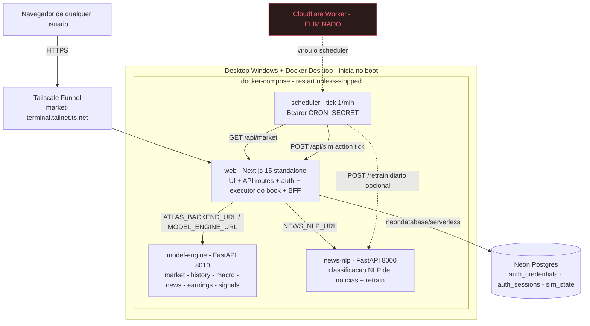

# Projeto: Market Terminal

## Sobre Este Documento

Este é um **living document** — a fonte ATUAL de verdade do projeto Market Terminal (negócio + arquitetura).

- **Atualizado conforme decisões evoluem** — reflete descobertas técnicas e mudanças de planejamento.
- **Documenta mudanças** — changelog detalhado com justificativas.
- **Fonte primária de consulta** — em caso de conflito com `documents/technical/` ou `documents/strategy/`, **este documento prevalece**.

> **Nota de honestidade documental:** o `CLAUDE.md` herdado do autor original descreve um estágio anterior do sistema (uso pessoal sem login, persistência em arquivo JSON, tudo em TypeScript). O código real já evoluiu muito além disso (auth com sessão+PBKDF2, Neon Postgres, dois serviços Python). **Este `Projeto.md` documenta o estado REAL** — corrigir a documentação defasada é pré-requisito de qualquer evolução estrutural (ver §1 e §7/SP0).

**Última revisão:** 2026-06-28 | **Versão:** 1.0.0

---

## Metadata

- **Versão:** 1.0.0
- **Status:** Ativo — Ciclo 1 / SP0 (Fundação & Documentação)
- **Última atualização:** 2026-06-28
- **Responsável:** Fernando Bertholdo
- **Autoria original:** João Gabriel de Ouro Preto (`joaoouro`) — repositório `upstream` preservado
- **Organização:** Uso pessoal evoluindo para círculo fechado (~10 usuários de confiança)
- **Tipo:** Aplicação web full-stack self-hosted — terminal de mercado FICC + simulador quant de paper-trading
- **Repositório (`origin`):** `github.com/fernando-bertholdo/market-terminal` (privado)
- **Repositório (`upstream`):** `github.com/joaoouro/Market-Terminal` (privado, autoria de João)

---

## Referências Principais

- [Roadmap.md](Roadmap.md) — Fases, milestones e DoR/DoD (gestão)
- [TODO.md](TODO.md) — Tarefas granulares e progresso diário
- [../../CLAUDE.md](../../CLAUDE.md) — Guia de arquitetura para Claude Code (fontes de dados, design system, padrões)
- [../../AGENTS.md](../../AGENTS.md) e [../../.claude/CLAUDE.md](../../.claude/CLAUDE.md) — Regras de desenvolvimento sempre ativas
- [Design do Ciclo 1 (SP0+SP1)](../superpowers/specs/2026-06-28-market-terminal-selfhost-foundation-design.md) — Spec da transição self-hosted/multi-tenant (origem das decisões D1–D8)
- [../../DEPLOY.md](../../DEPLOY.md) — Notas de deploy

## Links Relacionados

### Estratégia

- [vision-strategy.md](../strategy/vision-strategy.md) — Por que o projeto existe e para onde vai
- [constraints-no-goals.md](../strategy/constraints-no-goals.md) — Limites e não-objetivos
- [risk-assumptions.md](../strategy/risk-assumptions.md) — Riscos, premissas e dependências

---

## 1. Resumo Executivo

### Contexto

O **Market Terminal** é um terminal de mercado FICC (Fixed Income, Currencies & Commodities) no estilo Bloomberg, com UI densa, escura e navegável por teclado, mostrando rates, FX, commodities e notícias de Brasil/EUA/global em tempo (quase) real — somado a um **simulador quant de paper-trading** que aplica um motor de sinais grounded em pesquisa publicada e mantém um book de papel persistente.

Ele nasceu como **ferramenta pessoal single-tenant** de João Gabriel de Ouro Preto (estagiário de trading FICC, foco Brasil) e foi hospedado no Vercel. João deu a Fernando acesso irrestrito ao repositório e liberdade para desenvolver. Fernando agora conduz o projeto a partir de um **repositório próprio** (`fernando-bertholdo/market-terminal`, com a origem mantida como `upstream`), preservando integralmente a autoria de João.

### Problema

O sistema parou de operar e está bloqueado para colaboração e evolução:

1. **Vercel Free Tier atingido** — os limites de compute/bandwidth do plano Hobby foram estourados e a aplicação saiu do ar.
2. **Colaboração bloqueada** — adicionar Fernando como contribuidor no projeto Vercel exigiria plano PRO (custo recorrente).
3. **Falta de controle / soberania** — Fernando dispõe de um desktop Windows doméstico com uptime quase contínuo e ocioso, ideal para auto-hospedar a aplicação sem depender de PaaS.
4. **Documentação defasada** — o `CLAUDE.md` herdado descreve um sistema que não existe mais; qualquer mudança estrutural guiada por esse mapa errado gera retrabalho.
5. **Trava arquitetural para crescer** — o sistema é single-tenant em pontos âncora explícitos (uma credencial global, um book global), o que impede atender mais de um usuário.

### Solução Proposta

Reposicionar o Market Terminal como uma **plataforma self-hosted** rodando no desktop Windows de Fernando via Docker Compose, exposta publicamente por **Tailscale Funnel** (URL estável `https://…ts.net`, qualquer navegador, sem o visitante instalar nada, custo zero). Um container **scheduler** interno substitui o Cloudflare Worker que dava o "tick" periódico no ambiente serverless. O banco **Neon Postgres** é mantido no primeiro corte (zero refactor de driver), num projeto próprio de Fernando.

A entrega macro é faseada (ver §7):

- **Ciclo 1 (atual):** fundação — repositório próprio + metodologia portada + **documentação do estado real** (SP0) e **self-hosting** no Windows (SP1).
- **Ciclos 2+:** evolução para **multi-tenant** num círculo fechado (~10 usuários de confiança), onde cada pessoa tem seu próprio robô/estratégia, sua UI e suas configurações — preservando o isolamento de dados e o invariante de não-lookahead do simulador.

### Valor Esperado

**Destravamento e redução de custo/risco:**

- Voltar o sistema ao ar **sem custo recorrente** de PaaS (sai do Vercel; Neon Free + Tailscale Free no 1º corte).
- **Soberania de dados e de infraestrutura** — a aplicação roda em hardware próprio, com setup reproduzível (Docker Compose) que facilita a futura migração para Postgres local.
- **Documentação confiável** — o `Projeto.md` e o `CLAUDE.md` passam a refletir o sistema real, eliminando a principal fonte de retrabalho.

**Ganhos operacionais e de produto:**

- **URL pública estável** acessível por qualquer navegador, sem instalação no cliente.
- **Uptime alto** via `restart: unless-stopped` + Docker no boot + Tailscale como serviço (uptime de PC doméstico é assumido como aspiracional, adequado a um círculo fechado).
- **Caminho de evolução claro** para multi-tenancy (robô/UI/config por usuário) sobre uma fundação documentada e isolável.

---

## 2. Objetivos e Escopo

### Objetivo Principal

Transformar uma ferramenta FICC pessoal, defasada na documentação e presa ao Vercel, em uma **plataforma self-hosted, documentada no estado real e pronta para multi-tenant** de um círculo fechado — sem nunca quebrar dois invariantes do produto: **paper-only** (jamais envia ordem real) e **não-lookahead** (sinais em `t` não enxergam preços após `t`).

### Objetivos Específicos

1. **Fundação de repositório e metodologia (SP0)**
   - Repositório próprio privado com histórico e autoria de João preservados e `upstream` configurado.
   - Metodologia de desenvolvimento de Fernando portada (estrutura `documents/`, `.planning/`, configs multi-IA em `.claude/`, `.agents/`, `AGENTS.md`).
   - Estado real documentado em `Projeto.md` + `CLAUDE.md`/`AGENTS.md`.

2. **Self-hosting no Windows (SP1)**
   - Rodar a stack inteira (web Next + `model-engine` + `news-nlp` + `scheduler`) em Docker Compose no desktop Windows, com auto-restart e início no boot.
   - Expor o terminal por uma URL pública estável (Tailscale Funnel).
   - Manter o Neon como banco (projeto próprio de Fernando) no 1º corte.
   - Substituir o Cloudflare Worker pelo `scheduler` interno (tick a cada minuto).

3. **Evolução multi-tenant (Ciclos 2+)**
   - Introduzir `user_id` em toda a camada de dados com isolamento verificado (row-level).
   - Robô/estratégia, workspace/UI e configurações por usuário.

### Escopo

#### Incluído (Ciclo 1 — foco atual)

- [ ] Repositório próprio + `upstream` + metodologia portada (SP0).
- [ ] Estado real documentado (este `Projeto.md`, `CLAUDE.md`/`AGENTS.md`, roadmap) (SP0).
- [ ] `next.config.js` com `output: 'standalone'` + `Dockerfile` do `web` (SP1).
- [ ] `docker-compose.yml` orquestrando `web`, `model-engine`, `news-nlp`, `scheduler` (SP1).
- [ ] Container `scheduler` (tick 1/min + retrain diário opcional) substituindo o Worker (SP1).
- [ ] Tailscale Funnel no host Windows apontando para o `web` (SP1).
- [ ] Neon próprio de Fernando como `DATABASE_URL` (SP1).

#### Não Incluído (Ciclo 1)

**Fora de escopo inicial (vai para ciclos posteriores):**

- Multi-tenancy de fato (`user_id` em tudo, auth multi-usuário) → **SP2**.
- Robô/estratégia por usuário → **SP3**.
- Customização de UI e configs por usuário (migrar `localStorage` → servidor) → **SP4**.
- Postgres local (eliminar Neon) → fase futura, destravada pelo SP2/D7 e formalizada em D8.

**Explicitamente não-objetivos (escala círculo fechado):**

- Signup público, billing, recuperação de senha, verificação de e-mail.
- Execução de ordens reais (o produto é **paper-only** por princípio, não por limitação).
- Compliance pesado / LGPD de escala — provisionamento é por convite/admin entre pessoas de confiança.

---

## 3. Arquitetura do Sistema

### Visão Geral (arquitetura-alvo do Ciclo 1 — self-hosted)

### Fluxo de dados do terminal

O padrão central do front-end é **fetchers → API routes → SWR hooks → widgets**, tudo renderizado dentro do shell de navegação (ATLAS v2):

1. **Fetchers** (`src/lib/fetchers/`) — um adaptador por fonte (`bcb`, `fred`, `yahoo`, `yahooHistory`, `b3`, `news`). Todos retornam `null` em falha e logam, **nunca lançam exceção** ao chamador.
2. **API routes** (`src/app/api/*/route.ts`) — agregam fontes via `Promise.allSettled`; falhas parciais retornam campos `null` + `SourceStatus` por fonte. Toda resposta usa o envelope `ApiResponse<T>` (`{ data, fetchedAt, error, sources }`) e responde **HTTP 200 mesmo em falha de dado** — a UI renderiza `null` como `---` e mostra a saúde das fontes na StatusBar.
3. **SWR hooks** (`src/hooks/`) — `useMarketData`, `useNews`, `useSim`, `useHistory`, etc., com polling por cadência (`REFRESH_INTERVALS`).
4. **Widgets / páginas ATLAS** (`src/components/atlas/`) — o shell `AtlasShell.tsx` tem cinco páginas: Overview, Markets, Macro, Quant e News. Navegação por teclado (`1`–`5`, `Ctrl+K`/`/` para o command palette, `R` refresh).

**Delegação ao backend Python (BFF/thin):** quando `ATLAS_BACKEND_URL`/`MODEL_ENGINE_URL` está configurado, as rotas Next delegam dados pesados (market, history, macro, news, earnings, signals) ao `model-engine` via `src/lib/backend/pythonBackendClient.ts`; sem ele, caem nos fetchers TypeScript locais. O Next, assim, atua como **casca de UI + autenticação + executor do paper book + BFF**.

### Componentes Principais

#### 1. **web — Next.js 15 (App Router, TypeScript)**

**Responsabilidade:** servir a UI, as rotas de API, a autenticação por sessão, o executor do paper book e a camada BFF que orquestra os serviços Python.

**Pontos-chave:**
- `src/app/api/market/route.ts` — agrega BCB + FRED + Yahoo + B3; inclui `fixedIncomeRisk` (DI1 PU/duração/DV01).
- `src/app/api/news/route.ts` — agregação RSS com cache por fonte, single-flight, stale-if-error e saúde de fonte.
- `src/app/api/history/route.ts` — closes diários por símbolo (`?symbols=BRL=X,CL=F&range=1y`).
- `src/app/api/macro/route.ts` — dashboard macro (FRED + IPCA 12m + medianas do Focus via Olinda Expectativas).
- `src/app/api/sim/route.ts` — modelo quant ao vivo: sinais + book de papel persistente; aceita `POST` com `action: 'tick' | 'rebalance' | 'reset'`.
- `src/lib/auth.ts` — credenciais e sessões (PBKDF2-SHA256, 210.000 iterações, sessão de 30 dias).
- `src/middleware.ts` — gate de autenticação no Edge; bypass para requisições de cron (`Bearer CRON_SECRET`) em `/api/sim` e `/api/market`.
- `src/lib/sim/` — motor de sinais e portfólio de papel (detalhado em §5).

#### 2. **model-engine — serviço Python (FastAPI, `atlas-backend` v0.2.0, porta 8010)**

**Responsabilidade:** market data, históricos, macro, intelligence de notícias e o motor de sinais quant.

**Endpoints:** `GET /health`, `GET /market`, `GET /market/terminal`, `GET /history`, `GET /macro`, `GET /news`, `GET /earnings`, `POST /signals`. Auth opcional via `ATLAS_BACKEND_TOKEN`/`MODEL_ENGINE_TOKEN` (Bearer).

**Arquivos:** `app.py`, `market.py`, `news.py`, `strategy.py` (`compute_signals`), `earnings.py`.

#### 3. **news-nlp — serviço Python (FastAPI, `atlas-news-nlp` v0.1.0, porta 8000)**

**Responsabilidade:** pipeline de NLP que classifica manchetes em temas, fatores macro e impactos por ativo (com confiança), além de refinamento contínuo (retrain).

**Endpoints:** `GET /health`, `POST /classify`, `POST /retrain`, `GET /retrain/status`. Auth opcional via `NEWS_NLP_TOKEN`. Carrega pesos `torch`/`transformers` (cache em `/models` via `HF_HOME`); suporta `WARMUP` no startup. O lado TS trata qualquer erro/timeout como **fallback para regex**, então a falha deste serviço nunca derruba as notícias.

**Arquivos:** `app.py`, `pipeline.py`, `mapping.py`, `retrain.py`.

#### 4. **scheduler — container leve (novo, SP1)**

**Responsabilidade:** dar o "tick" periódico que o ambiente serverless não permitia. A cada 60s chama `GET /api/market` e `POST /api/sim {action:'tick'}` com `Authorization: Bearer ${CRON_SECRET}`; opcionalmente dispara `POST /retrain` no `news-nlp` uma vez ao dia (gate por hora UTC, default 06:00). Substitui o `deploy/cloudflare-worker` (mantido no repo apenas por referência histórica).

#### 5. **Neon Postgres**

**Responsabilidade:** persistência. Tabelas: `auth_credentials`, `auth_sessions`, `sim_state`. Acessado pelo driver `@neondatabase/serverless` (compatível com o Edge Runtime usado no `middleware.ts`). Quando `DATABASE_URL` está ausente, o book cai num arquivo local `data/sim-state.json` (fallback de desenvolvimento).

#### 6. **Tailscale (no host, não no Compose)**

**Responsabilidade:** Funnel da porta do `web` para uma URL pública `https://…ts.net`, sem abrir portas no roteador nem exigir IP fixo. Roda como serviço (religa no boot).

### Stack Tecnológico

**Front-end / BFF — Next.js 15.5 + React 18.3 + TypeScript 5.5**

- **Framework:** `next@^15.5.18` (App Router), `react@^18.3.1`, `react-dom@^18.3.1`.
- **Dados (cliente):** `swr@^2.2.5` (polling/cache).
- **Gráficos:** `lightweight-charts@^4.2.0`.
- **Fontes de dado (server-side):** `yahoo-finance2@^2.11.3` (instalado; os fetchers chamam a API v8 do Yahoo diretamente), `rss-parser@^3.13.0`, `node-fetch@^3.3.2`.
- **Realtime (presente):** `socket.io-client@^4.8.1`.
- **Banco:** `@neondatabase/serverless@^1.1.0` (Neon Postgres, Edge-compatible).
- **Estilo:** Tailwind CSS `^3.4.6` + PostCSS + autoprefixer; design system "ATLAS" por CSS custom properties.
- **Qualidade:** TypeScript `tsc --noEmit`, ESLint `^8.57.0` + `eslint-config-next`. **Não há suíte de testes** — validação por `type-check` + `lint` + smoke-test das rotas de API.

**Serviços Python — FastAPI**

- `model-engine` e `news-nlp`, cada um com `Dockerfile`, `requirements.txt` e `README.md` próprios. `news-nlp` usa `torch`/`transformers` (modelos Hugging Face).

**Infra / Deploy**

- **Auth:** sessão em cookie (`atlas_session`) + PBKDF2-SHA256 (210k iterações) + tabelas no Postgres.
- **Orquestração:** Docker Compose (Windows + Docker Desktop), `restart: unless-stopped`.
- **Exposição:** Tailscale Funnel (1º corte); evolução futura para domínio próprio + Cloudflare Tunnel.
- **Scheduler:** container interno (substitui o Cloudflare Worker).

---

## 4. Domínio FICC e Catálogo de Instrumentos

O catálogo único de instrumentos vive em `src/lib/constants.ts` (`INSTRUMENTS`) e `src/lib/instrumentCatalog.ts` (registro com accessors no payload `/api/market`, que dá click-to-chart, watchlist editável, alertas de preço e comandos `CHART <nome>` no palette). Foco editorial: **Brasil + EUA + global**, FICC.

### Brasil — Rates

| Instrumento | Label | Fonte | Código/Ticker | Notas |
|---|---|---|---|---|
| SELIC | SELIC | BCB SGS | série `1178` | taxa de política anualizada (base 252) |
| CDI | CDI | BCB SGS | série `4392` | overnight anualizado |
| IPCA | IPCA | BCB SGS | série `433` | CPI mensal Brasil |
| DI Jul/26 | DI Jul/26 | B3 | `DI1N26` | DI futures, ponta curta |
| DI Jan/27 | DI Jan/27 | B3 | `DI1F27` | DI futures |
| DI Jan/28 | DI Jan/28 | B3 | `DI1F28` | DI futures |
| DI Jan/30 | DI Jan/30 | B3 | `DI1F30` | DI futures |

> Os códigos de contrato DI **expiram** e devem ser atualizados trimestralmente em `constants.ts` e `api/market/route.ts`. NTN-B não tem API pública gratuita (ANBIMA exige scraping) → **entrada manual**.

### Brasil — FX e Equity

| Instrumento | Label | Fonte | Ticker |
|---|---|---|---|
| USD/BRL | USD/BRL | Yahoo | `BRL=X` |
| EUR/BRL | EUR/BRL | Yahoo | `EURBRL=X` |
| Ibovespa | IBOV | Yahoo | `^BVSP` |

> PTAX (fixing oficial) via API Olinda do BCB (`CotacaoDolarDia`/`CotacaoMoedaDia`), publicada ~13:00 BRT; fetchers retrocedem até 7 dias para o último fix.

### EUA — Rates (FRED)

| Instrumento | Label | Série FRED |
|---|---|---|
| Fed Funds | Fed Funds | `FEDFUNDS` |
| US 2Y | US 2Y | `DGS2` |
| US 5Y | US 5Y | `DGS5` |
| US 10Y | US 10Y | `DGS10` |
| US 30Y | US 30Y | `DGS30` |
| 5Y Breakeven | 5Y Breakeven | `T5YIE` |
| 10Y Breakeven | 10Y Breakeven | `T10YIE` |

> FRED exige `FRED_API_KEY` (chave gratuita). Gráficos de yields US usam índices CBOE `^FVX`/`^TNX`/`^TYX`.

### EUA / Global — FX

| Instrumento | Ticker | | Instrumento | Ticker |
|---|---|---|---|---|
| DXY | `DX-Y.NYB` | | USD/JPY | `USDJPY=X` |
| EUR/USD | `EURUSD=X` | | GBP/USD | `GBPUSD=X` |

### Commodities (Yahoo)

| Instrumento | Ticker | Unidade | | Instrumento | Ticker | Unidade |
|---|---|---|---|---|---|---|
| WTI | `CL=F` | USD/bbl | | Iron Ore | `TIO=F` | USD/t |
| Brent | `BZ=F` | USD/bbl | | Soybeans | `ZS=F` | USc/bu |
| Gold | `GC=F` | USD/oz | | Corn | `ZC=F` | USc/bu |
| Silver | `SI=F` | USD/oz | | Copper | `HG=F` | USD/lb |

### Global / EM (contexto)

| Instrumento | Label | Fonte | Código |
|---|---|---|---|
| S&P 500 | S&P 500 | Yahoo | `^GSPC` |
| VIX | VIX | Yahoo | `^VIX` |
| EMBI+ BR | EMBI+ BR | FRED (proxy) | `BAMLEMFSFCRPIEY` |

### Dashboard de risco de renda fixa

`src/lib/fixedIncomeRisk.ts` calcula, por contrato DI1, o **PU teórico**, dias úteis, **duration de Macaulay/modificada**, **convexidade** e **DV01** na convenção zero-cupom da B3. Linhas de Treasury US são rotuladas explicitamente como **proxies de par-bond** (cupom semestral igual ao yield de maturidade constante do FRED, DV01 por USD 1m de face). Resultado em `/api/market.data.fixedIncomeRisk`, exibido na página Markets.

---

## 5. Regras de Negócio Críticas

### 5.1. Paper-only — nunca executa ordens reais

**Objetivo:** o simulador é educacional/analítico; jamais envia ordem a corretora.

**Regras:**
- `/api/sim` e a página Quant expõem **apenas** o modelo ao vivo, o book de papel atual, P&L, expressões hedgeadas, cenários e racional.
- Nenhuma integração de execução existe ou deve ser adicionada.

### 5.2. Invariante de não-lookahead (walk-forward)

**Objetivo:** integridade científica do sinal — o modelo nunca "vê o futuro".

**Regras:**
- Sinais em `t` **nunca** podem enxergar preços posteriores a `t`. Toda mudança que toque o motor de estratégia exige revisão dedicada a esse invariante.
- Os reads macro do sleeve MACRO são derivados **só de preços** (walk-forward safe).
- Em modo live, cotações intradiárias do Yahoo (micro-cache de 10s) são "splicadas" nos closes diários (`closesWithLive`) **substituindo a barra parcial de hoje ou anexando — nunca duplicando**.

### 5.3. Motor de sinais — três sleeves grounded em pesquisa

O `computeSignals` combina internamente trend de preço, diferenciais de juros, contexto econômico/notícias, regime e escala de risco numa **única carteira ao vivo**. O `/api/sim` expõe isso como `decisions[]` (uma decisão final `LONG`/`SHORT`/`FLAT`, convicção, peso-alvo e racional por ativo); os componentes internos **não** são apresentados como estratégias separadas.

- **TSMOM** — time-series momentum (Moskowitz, Ooi & Pedersen, JFE 2012): sinal do retorno trailing 12m mesclado com 3m; cada posição é escalada por `volTarget / volEWMA_exAnte`.
- **CARRY** — currency carry (Koijen, Moskowitz, Pedersen & Vrugt, JFE 2017): carrego de FX por diferencial de juros; implementado para USD/BRL usando **SELIC (BCB 1178) vs Fed Funds (FRED)**. Diferencial positivo → short `BRL=X` (long BRL).
- **MACRO** — economic trend / macro momentum (Brooks, AQR "A Half Century of Macro Momentum" 2017 + "Economic Trend" 2023): reads de fator calculados só de preços — sentimento de risco (VIX vs mediana de 1 ano + trend de 3m do SPX), crescimento (trend da razão copper/gold), trend do USD (DXY 3m) — mapeados por ativo com sinais econômicos (ouro anti-dólar/haven, JPY haven, EM penalizado por USD forte…).

### 5.4. Camada de risco e regime

**Objetivo:** dimensionar o book pela correlação real, não só pela vol por ativo, e condicionar a exposição ao regime.

**Regras / parâmetros reais (`DEFAULT_PARAMS`, `SIM_UNIVERSE`):**
- **Condicionamento de regime:** o book inteiro **de-grossa ×0,6 em RISK-OFF** e **×1,1 em RISK-ON**.
- **Vol targeting por covariância:** pesos escalados para que a vol ex-ante do portfólio √(wᵀΣw), sobre a covariância trailing-90d, atinja o **target de 10%** (`portfolioVolTarget = 0.10`).
- **Caps:** **40% por ativo** (`maxAssetWeight = 0.40`), **3x gross** (`maxGrossLeverage = 3`).
- **Equities temáticas** (vehicles de expressão macro de ação única, nunca trade de price-trend isolado): **5% por nome** (`maxWeight = 0.05`) e **8% por tema** (`THEMATIC_EQUITY_THEME_CAP = 0.08`).

**Universo (`SIM_UNIVERSE`): 27 ativos negociáveis** — 17 instrumentos macro core + 10 equities temáticas:

- **FX (4):** `BRL=X`, `EURUSD=X`, `USDJPY=X`, `GBPUSD=X`.
- **Commodities (5):** `CL=F` (WTI), `BZ=F` (Brent), `GC=F` (Gold), `HG=F` (Copper), `ZS=F` (Soybeans).
- **Equity index/ETF (8):** `^GSPC`, `^BVSP`, `EWZ`, `EEM`, `XLE`, `XLF`, `XLI`, `XLK`.
- **Temáticas (10, cap 5%):** `PBR`, `XOM` (energy); `VALE` (china-metals); `ITUB`, `JPM` (rates-credit); `LMT` (defense); `NVDA`, `MSFT` (ai-capex); `VST` (power-demand); `CAT` (industrial-cycle).
- **`CONTEXT_SYMBOLS` (não-negociados):** `^VIX`, `DX-Y.NYB`, `^TNX`, `ITA`, `SOXX`, `XLU` — lidos pelo sleeve macro e pelo filtro de regime, devem ser buscados junto ao universo.

> **Correção de doc defasada:** o `CLAUDE.md` herdado cita "11 símbolos Yahoo" no universo — o código real tem **27 ativos**. Este `Projeto.md` é a fonte correta.

### 5.5. Hedges explícitos e cenários

**Objetivo:** expressar pares hedgeados auditáveis sem lookahead.

**Regras (`src/lib/sim/hedging.ts`):**
- Constrói expressões para WTI/Brent, Ibovespa/SPX + FX BRL e carrego BRL vs cesta USD.
- **Hedge ratio `beta = -cov/var`** sobre as **trailing 120 observações** (mínimo 60, capado em ±2), usando só dados disponíveis no momento da decisão.
- Pernas são netadas de volta nos targets dos ativos; o `/api/sim` também retorna `expressions` para atribuição.
- DV01 é explicitamente **não-suportado** no hedging até o universo ter instrumentos de rates próprios e metadados de contrato.
- `src/lib/sim/scenarios.ts` faz stress-test do book ao vivo via betas de correlação.

### 5.6. Book de papel — persistência e rebalanceamento

**Objetivo:** manter um portfólio de papel consistente, marcado a mercado, resiliente a reinício.

**Regras (`src/lib/sim/stateStore.ts`, `engine.ts`):**
- Persistido no Neon (tabela `sim_state`, `id = 'paper-book'`, JSONB versionado); fallback em arquivo se sem `DATABASE_URL`. O `/api/sim` reporta `"persistence": "postgres"` quando no Neon.
- Marcado a mercado a preços live a cada request.
- **Rebalance completo 1×/dia** (âncora diária) + **rebalance intradiário por banda de tolerância**: um ativo só negocia quando `|target − atual| > 2% do equity` (`driftBandPct = 0.02`).
- `state.intradayEquity` mantém uma fita rolante (~400 marcas, espaçamento ≥1min) para o gráfico de P&L ao vivo; state files antigos são migrados no load.

### 5.7. Resiliência de fontes de dados

**Objetivo:** falha parcial nunca derruba a UI.

**Regras:**
- Todo fetcher retorna `null` em falha e loga; nunca lança ao chamador.
- Rotas agregam via `Promise.allSettled`, devolvem `ApiResponse<T>` com `sources: SourceStatus[]` e **HTTP 200 mesmo em falha de dado**; a UI mostra `---` e a saúde por fonte na StatusBar.
- Notícias: classificação NLP no `news-nlp`; qualquer erro/timeout cai no classificador determinístico (regex) — notícias nunca caem.

### 5.8. Isolamento single-tenant atual (invariante de migração futura)

**Objetivo:** preparar o terreno para o SP2 sem vazar dados entre usuários.

**Estado atual (pontos âncora single-tenant — mapa inicial do SP2):**
- `src/lib/auth.ts` → `CREDENTIAL_ID = 'primary'` (uma credencial global).
- `src/lib/sim/stateStore.ts` → `STATE_ID = 'paper-book'` (um book global).
- `src/middleware.ts` → sessão valida "logado/não-logado", sem identidade de tenant; faz `SELECT` no Edge (preso ao driver Neon).
- Hooks `useWatchlist`/`useAlerts`/`useTerminalPreferences`/`useTerminalWorkspace` → estado em `localStorage` (por navegador).

**Regra de migração (quando chegar o SP2):** centralizar o acesso a dados numa camada única que **exige `user_id`** como parâmetro, com verificação adversarial de isolamento por endpoint (num modelo row-level, um único filtro esquecido vaza dados).

---

## 6. Decisões-Chave (ADRs D1–D8)

Decisões registradas no design do Ciclo 1. D1–D6 valem para o Ciclo 1; D7–D8 são futuras (Ciclo 2+ / self-hosted 100%).

### D1 — Repositório próprio (duplicação), não fork formal do GitHub
- **Contexto:** o repo de origem é privado e de terceiro; o trabalho planejado é uma *divergência* (reescrita da fundação de dados/infra), não contribuição incremental.
- **Decisão:** repo novo e privado na conta de Fernando (`fernando-bertholdo/market-terminal`), com o histórico completo, e a origem como `upstream` (`joaoouro/Market-Terminal`).
- **Justificativa:** forks de repo privado ficam reféns do acesso de Fernando ao upstream — se revogado/arquivado, o GitHub pode desabilitar o fork. A duplicação dá independência e ainda preserva a autoria de João.
- **Consequência:** sincronização com o upstream passa a ser manual via git (`fetch`/`merge`/cherry-pick), aceitável porque a base vai divergir bastante.

### D2 — Escala "círculo fechado" (~10 usuários)
- **Decisão:** projetar para ~10 usuários conhecidos, provisionados por convite/admin.
- **Justificativa:** dimensiona corretamente a segurança e o isolamento — **row-level** (banco compartilhado + `user_id`) é suficiente; signup/billing/LGPD pesado saem do escopo.

### D3 — Manter Neon no 1º corte (projeto próprio de Fernando)
- **Contexto:** o código usa `@neondatabase/serverless`, driver específico que funciona no Edge Runtime (usado pelo `middleware.ts`).
- **Decisão:** Fernando cria o **próprio** projeto Neon (não reusa o do João); a dor real (Vercel) é resolvida sem mexer no banco.
- **Justificativa/Consequência:** zero refactor de driver agora; o sistema ainda não fica 100% self-contained (depende do Neon na nuvem). Postgres local fica para fase futura (D8).

### D4 — Docker Compose no Windows
- **Decisão:** orquestrar `web`, `model-engine`, `news-nlp` e `scheduler` via `docker-compose` com `restart: unless-stopped`; Docker Desktop iniciando no boot.
- **Justificativa:** os serviços Python já têm `Dockerfile`; políticas de restart entregam o uptime desejado; o setup reproduzível facilita a futura migração para Postgres local.

### D5 — Tailscale Funnel para exposição pública
- **Decisão:** expor o `web` por Tailscale Funnel (`https://<host>.<tailnet>.ts.net`).
- **Justificativa:** URL pública estável, qualquer navegador, sem o visitante instalar nada, sem abrir portas no roteador, sem IP fixo, custo zero; roda como serviço (religa no boot).
- **Consequência:** URL não-branded (`*.ts.net`); migração futura para domínio próprio + Cloudflare Tunnel é trivial (não toca a aplicação).

### D6 — Tick interno substitui o Cloudflare Worker
- **Contexto:** o Worker existe só porque funções serverless (Vercel) não rodam loops contínuos. Ele fazia, a cada minuto, `GET /api/market` + `POST /api/sim {action:'tick'}` com `Bearer CRON_SECRET`, e um `POST /retrain` diário opcional no `news-nlp`.
- **Decisão:** substituir o Worker por um container `scheduler` interno no Compose que replica esse comportamento.
- **Importante:** o **Worker** (peça externa) é eliminado; o **`CRON_SECRET` permanece** — passa a autenticar o scheduler interno contra os mesmos endpoints liberados pelo `middleware.ts`.

### D7 — (Futuro, SP2) Sessão por token assinado
- **Decisão futura:** ao reescrever o auth para multi-tenant, trocar a validação de sessão (hoje um `SELECT` no Postgres dentro do `middleware.ts`/Edge) por um **token assinado**, verificável sem tocar o banco no Edge.
- **Benefício:** desacopla o middleware do driver Neon → destrava a migração para Postgres local "de graça".

### D8 — (Futuro) Self-hosted 100% (Postgres local)
- **Decisão futura:** após D7, migrar `DATABASE_URL` de Neon para um Postgres local containerizado; backup vira `pg_dump` agendado.

---

## 7. Fases do Projeto

O projeto é decomposto em **sub-projetos (SP0–SP5)** agrupados em ciclos. O Ciclo 1 (foco atual) cobre SP0 + SP1.

### Visão Geral

| Ciclo | Sub-projeto | Entrega | Status |
|---|---|---|---|
| **1** | **SP0 · Fundação & docs** | Repo próprio + metodologia portada + estado real documentado + roadmap | Em andamento |
| **1** | **SP1 · Self-hosting** | Compose no Windows + Neon próprio + Tailscale Funnel + tick interno | A iniciar |
| 2 | SP2 · Multi-tenancy core | `user_id` em tudo; auth multi-user com token assinado (D7); isolamento via camada única de acesso | Futuro |
| 3 | SP3 · Robô por usuário | Estratégia/parâmetros por pessoa; `model-engine` multi-perfil | Futuro |
| 3 | SP4 · Workspace & UI por usuário | `localStorage` → servidor por usuário; temas/presets | Futuro |
| 4 | SP5 · Funcionalidades personalizadas | Sobre a fundação do SP2 | Futuro |
| 4 | (Futuro) Self-hosted 100% | Postgres local (D8), destravado por D7 | Futuro |

> O detalhamento operacional (timeline, milestones, DoR/DoD) vive em [Roadmap.md](Roadmap.md). Cada sub-projeto a partir do SP2 terá seu próprio ciclo spec → plano → implementação.

### Critérios de aceite — Ciclo 1

**SP0 (Fundação & docs):**
- [x] Repo próprio privado no ar, histórico de João preservado, `upstream` configurado.
- [ ] Estrutura `documents/` + `.planning/` + configs multi-IA presentes.
- [ ] `CLAUDE.md`/`AGENTS.md` refletem o estado real; `Projeto.md` e `Roadmap.md` criados.

**SP1 (Self-hosting):**
- [ ] `docker-compose up` sobe `web` + `model-engine` + `news-nlp` + `scheduler` no Windows.
- [ ] Terminal acessível por `https://…ts.net` de qualquer navegador, sem instalação no cliente.
- [ ] `/api/sim` reporta `"persistence": "postgres"` (Neon próprio).
- [ ] Após 2+ minutos sem navegador aberto, o `asOf` do book avança e o equity intraday ganha marcas (tick interno funcionando).
- [ ] Serviços reiniciam sozinhos após `docker restart` e após reboot do Windows.
- [ ] Cloudflare Worker não é mais necessário para o tick.

---

## 8. Métricas de Sucesso

### Qualidade técnica (não há suíte de testes formal)

- `npm run type-check` (tsc `--noEmit`) e `npm run lint` (ESLint) **sem erros** antes de qualquer merge.
- Smoke-test das rotas contra um dev server (ex.: `GET http://localhost:3000/api/market`) retornando `ApiResponse` válido.
- Para mudanças no simulador: revisão explícita do invariante de **não-lookahead** (§5.2).

### Confiabilidade operacional (alvo do Ciclo 1)

- Terminal acessível pela URL pública com **uptime alto** (aspiracional para PC doméstico, adequado ao círculo fechado).
- Tick interno avançando o book a cada minuto sem navegador aberto.
- Falhas parciais de fonte **não derrubam a UI** (renderiza `---` + saúde por fonte).

### Valor

- Aplicação **de volta ao ar sem custo recorrente** de PaaS.
- Documentação **alinhada ao código real** (eliminação do drift do `CLAUDE.md` herdado).
- Fundação pronta para **multi-tenant** com isolamento verificável.

---

## 9. Riscos e Dependências

### Riscos

| Risco | Prob. | Impacto | Mitigação |
|---|---|---|---|
| Uptime de PC doméstico (luz/internet, reboot do Windows) | Média | Médio | `restart: unless-stopped` + Docker no boot + Tailscale como serviço; 100% é aspiracional para círculo fechado |
| Perda de dados no Neon | Baixa | Alto | Backup automático do Neon no 1º corte; `pg_dump` agendado ao migrar para local (D8) |
| Vazamento de tenant no SP2 (row-level) | Média | Alto | Camada única de acesso exigindo `user_id` + verificação adversarial por endpoint |
| Edge Runtime preso ao driver Neon | Média | Médio | Resolver no SP2 via token assinado (D7) |
| Quebra do invariante de não-lookahead | Baixa | Alto | Revisão dedicada a cada mudança que toque o simulador |
| Divergência do upstream dificultar merges | Alta | Baixo | Aceito conscientemente (D1); upstream mantido só para cherry-picks pontuais |
| Códigos de contrato DI expirarem (dado some) | Alta | Baixo | Atualização trimestral em `constants.ts` e `api/market/route.ts` |
| `news-nlp` re-baixar pesos a cada restart (cold start) | Média | Baixo | Volume persistente em `/models` (`HF_HOME`) + `WARMUP` no startup |

### Dependências Externas

**Críticas:**
- **Neon Postgres** — `DATABASE_URL` (auth e book). Sem ele, auth não funciona e o book cai em arquivo local.
- **FRED** — `FRED_API_KEY` (rates US, breakevens). Chave gratuita.

**Sem autenticação (mas externas):**
- **BCB** (SGS, PTAX Olinda, Focus/Expectativas), **B3** (DI futures), **Yahoo Finance** (FX, commodities, índices), **RSS** de notícias (Bloomberg, Google News proxy para Reuters, feeds de bancos centrais e agências).

**Opcionais:**
- `ATLAS_BACKEND_URL`/`MODEL_ENGINE_URL` (habilita o `model-engine`), `NEWS_NLP_URL` (habilita classificação ML + retrain), `CRON_SECRET` (tick), providers extras (Tiingo, Finnhub) se desejado.

---

## 10. Glossário

**FICC:** Fixed Income, Currencies & Commodities — a fatia de mercado coberta pelo terminal.

**Paper-trading / book de papel:** simulação de carteira que marca posições a mercado e calcula P&L **sem nunca enviar ordens reais**.

**Não-lookahead (walk-forward):** invariante de que um sinal calculado em `t` não usa nenhuma informação de preço posterior a `t`.

**Sleeve:** um "braço" do motor de sinais (TSMOM, CARRY, MACRO) que contribui com uma vista; combinados numa única carteira.

**TSMOM:** time-series momentum (Moskowitz/Ooi/Pedersen, JFE 2012).

**CARRY:** estratégia de carrego de FX por diferencial de juros (Koijen/Moskowitz/Pedersen/Vrugt, JFE 2017).

**Vol targeting por covariância:** escalar pesos para que √(wᵀΣw) (vol ex-ante do portfólio, covariância trailing-90d) atinja o alvo (10%).

**Regime conditioning:** ajustar o gross do book conforme RISK-ON (×1,1) / RISK-OFF (×0,6).

**DV01 / duration / convexidade:** medidas de sensibilidade de renda fixa, calculadas por contrato DI1 na convenção zero-cupom da B3.

**DI futures:** contratos de juros futuros da B3 (ex.: `DI1F27`); campo `curPrc` = taxa anual %.

**SELIC / CDI / IPCA:** taxa de política BR / overnight interbancário / inflação (CPI) BR — séries BCB SGS `1178`/`4392`/`433`.

**PTAX:** fixing oficial de câmbio do BCB (API Olinda).

**Focus:** pesquisa de expectativas de mercado do BCB (API Olinda Expectativas).

**BFF (Backend-for-Frontend):** papel do Next neste sistema — orquestra os serviços Python e entrega payloads prontos para a UI.

**Tick:** chamada periódica (1/min) que avança o book e atualiza dados — feita pelo `scheduler` (antes, pelo Cloudflare Worker).

**Single-tenant / multi-tenant:** um usuário global vs. múltiplos usuários isolados por `user_id`.

**Tailscale Funnel:** recurso que expõe um serviço local numa URL pública `*.ts.net` sem abrir portas.

**ATLAS:** nome do design system e do shell de UI atual (`AtlasShell`).

---

## 11. FAQ

**P: O simulador pode mandar ordens reais para uma corretora?**
R: Não. É **paper-only** por princípio de produto (§5.1). Não há, e não deve haver, integração de execução.

**P: Por que manter o Neon em vez de já usar Postgres local?**
R: O driver `@neondatabase/serverless` funciona no Edge Runtime (usado no `middleware.ts`) e a dor real era o Vercel, não o banco (D3). Postgres local fica para depois, destravado pelo token assinado (D7/D8).

**P: O que aconteceu com o Cloudflare Worker?**
R: Foi **eliminado** e substituído pelo container `scheduler` interno (D6). O `CRON_SECRET` permanece, agora autenticando o scheduler contra `/api/market` e `/api/sim`.

**P: Os sinais são calculados em TypeScript ou Python?**
R: Ambos existem: há `compute_signals` no `model-engine` (Python) e o motor em `src/lib/sim/` (TypeScript). O Next delega ao Python quando `MODEL_ENGINE_URL` está configurado; senão usa os fetchers/lógica TS locais.

**P: Por que o `CLAUDE.md` diz "11 símbolos" e aqui diz 27?**
R: O `CLAUDE.md` herdado está defasado. O `SIM_UNIVERSE` real tem **27 ativos** (§5.4). Este `Projeto.md` é a fonte correta.

**P: Quem é o autor original e como a autoria é preservada?**
R: João Gabriel de Ouro Preto (`joaoouro`). O histórico de commits dele é mantido intacto e o repo dele segue como `upstream` (D1).

---

## 12. Quando Atualizar Este Documento

Atualize quando:

- **Decisões técnicas são tomadas** (nova fonte de dado, mudança de infra, troca de banco, etc.).
- **Descobertas técnicas ocorrem** (ex.: divergência entre doc e código).
- **Regras de negócio evoluem** (parâmetros de risco, universo do simulador, invariantes).
- **Arquitetura é modificada** (novo serviço, novo endpoint, mudança de fluxo).
- **Sub-projetos/milestones são completados** (atualizar status em §7).
- **Riscos se materializam ou novos surgem.**

**Processo:**
1. Fazer a mudança na seção relevante.
2. Atualizar a versão (semver: MAJOR.MINOR.PATCH).
3. Adicionar entrada no Changelog (§13).
4. Atualizar "Última revisão" no topo.
5. Referenciar no [Roadmap.md](Roadmap.md) o registro relevante do Changelog ao concluir milestone.

---

## 13. Changelog

### v1.0.0 (2026-06-28)

**Criação inicial (estado real):**
- Documentado o sistema REAL do Market Terminal, corrigindo o `CLAUDE.md` defasado: auth com sessão+PBKDF2 (210k iter) + Neon Postgres, dois serviços Python FastAPI (`model-engine` :8010, `news-nlp` :8000), Next como casca + auth + executor do book + BFF.
- Registrado o domínio FICC e o catálogo real de instrumentos (rates BR/US, FX BRL/global, commodities, DI futures B3, breakevens, EMBI+).
- Documentado o motor de sinais (TSMOM/CARRY/MACRO), a camada de risco/regime, o universo real de 27 ativos e os invariantes paper-only e não-lookahead.
- Registradas as decisões D1–D8 da transição self-hosted/multi-tenant.
- Mapeado o roadmap SP0–SP5 e os critérios de aceite do Ciclo 1.

**Autor:** Fernando Bertholdo
**Contexto:** SP0 (Fundação & Documentação) — kickoff do fork próprio a partir de `joaoouro/Market-Terminal`.

---

## Skills Aplicáveis

**Antes de iniciar milestone:**
- `validate-dor [milestone-id]` — Validar Definition of Ready

**Durante o desenvolvimento:**
- `pre-commit-check` — Checklist completo antes de commit
- `type-check` + `lint` — gate de qualidade (não há suíte de testes)

**Após completar milestone:**
- `validate-dod [milestone-id]` — Validar Definition of Done
- `update-docs task [milestone-id]` — Atualizar Projeto.md (decisões/entregas + Changelog) e referenciar no Roadmap.md

**Manutenção:**
- `update-docs roadmap` — Reprioritizar Roadmap/TODO quando decisões mudarem o plano
- `validate-docs-links check` — Validar sistema de links
- `audit-architecture` — Auditar redundância em documentação

---

**Última atualização:** 2026-06-28
**Versão:** 1.0.0
**Mantido por:** Fernando Bertholdo
