# Diagrama de Sequencia — Fluxo de Kickoff do Template

<!-- @kickoff-exclude -->

> **Tipo:** Documentacao tecnica de referencia
> **Versao:** 2.0.0
> **Ultima atualizacao:** 2026-04-02
> **Referencia:** [ai-assisted-workflow.md](ai-assisted-workflow.md) | [kickoff-prompt.md](../../.claude/prompts/kickoff-prompt.md) | [design-sprint](../../.claude/skills/design-sprint/SKILL.md)

---

## Visao Geral

Este diagrama documenta o fluxo completo de kickoff do template, desde a exploracao de design ate a validacao e commit inicial. O fluxo e dividido em 5 fases:

1. **Design Sprint** (opcional) — Exploracao colaborativa de design, gerando strategy docs
2. **Pre-Kickoff** — Preparacao do repositorio e materiais de contexto
3. **Kickoff** — Execucao do prompt de kickoff (6 steps)
4. **Validacao** — Verificacao automatica e manual
5. **Commit Inicial** — Versionamento e transicao para Fase 0

---

## Diagrama de Sequencia

```mermaid
sequenceDiagram
    autonumber

    actor Dev as Developer
    participant GH as GitHub<br/>(Template)
    participant DS as design-sprint<br/>(Skill)
    participant Strat as documents/<br/>strategy/
    participant Archive as documents/<br/>archive/
    participant TAP as generate-tap<br/>(Skill)
    participant KP as kickoff-prompt<br/>(Prompt)
    participant FS as Filesystem<br/>(Template Files)
    participant VK as validate-kickoff<br/>(Skill)
    participant VDL as validate-docs-links<br/>(Skill)
    participant Git as Git

    %% ═══════════════════════════════════════
    %% DESIGN SPRINT (OPCIONAL)
    %% ═══════════════════════════════════════

    rect rgb(255, 245, 230)
        Note over Dev, Git: FASE 0 — Design Sprint (Opcional)

        opt Se nao ha materiais brutos (ideia rough)
            Dev ->>+ DS: design-sprint

            DS ->> Dev: Classificar projeto:<br/>user-facing? commercial? competitive?
            Dev -->> DS: Respostas (flags)
            DS ->> DS: Determinar Tier 1 (4 docs) + Tier 2 (0-3 docs)

            loop Para cada dimensao (ordem: vision → constraints → metrics → risks [→ Tier 2])
                DS ->> Dev: Perguntas guiadas da dimensao
                Dev -->> DS: Respostas e reflexoes
                DS ->> DS: Sintetizar exploracao
                DS ->> Strat: Gerar documento da dimensao
                DS -->> Dev: "Dimensao N/T concluida: [nome]"
            end

            DS ->> Strat: Review de consistencia<br/>(cross-refs, terminologia, conflitos)
            DS -->>- Dev: Relatorio: docs gerados,<br/>correcoes de consistencia,<br/>proximos passos
        end
    end

    %% ═══════════════════════════════════════
    %% PRE-KICKOFF
    %% ═══════════════════════════════════════

    rect rgb(245, 235, 220)
        Note over Dev, Git: FASE 1 — Preparacao (Pre-Kickoff)

        Dev ->>+ GH: "Use this template" / gh repo create
        GH -->>- Dev: Repositorio criado com estrutura do template

        Dev ->> Archive: Depositar materiais brutos
        Note right of Archive: TAP.pdf<br/>transcricao_discovery.txt<br/>spec_tecnica.md<br/>diagramas, mockups<br/>(ou strategy docs do design-sprint)

        opt Se ha multiplos materiais brutos
            Dev ->>+ TAP: generate-tap
            TAP ->> Archive: Escanear documents/archive/
            Archive -->> TAP: Lista de materiais (PDFs, TXTs, MDs, imagens)

            loop Para cada material
                TAP ->> TAP: Ler conteudo completo
                TAP ->> TAP: Extrair 5-15 bullets tagueados<br/>[FATO] [DECISAO] [DUVIDA] [RISCO] [PREMISSA]
            end

            TAP ->> TAP: Consolidar informacoes por secao
            TAP ->> TAP: Detectar conflitos entre fontes
            TAP ->> TAP: Gerar Mapa de Extracao (Apendice B)<br/>Placeholder → Secao → Valor

            TAP ->> Archive: Salvar TAP_{PROJECT_SLUG}.md
            TAP -->>- Dev: Relatorio: secoes completas, gaps,<br/>perguntas pendentes, conflitos

            opt Se ha perguntas pendentes
                Dev ->> Dev: Responder perguntas<br/>e revisar premissas
            end
        end
    end

    %% ═══════════════════════════════════════
    %% KICKOFF
    %% ═══════════════════════════════════════

    rect rgb(220, 235, 250)
        Note over Dev, Git: FASE 2 — Execucao do Kickoff

        Dev ->>+ KP: Invocar kickoff-prompt.md

        %% Step 1: Extrair Informacoes
        rect rgb(200, 225, 245)
            Note over KP, Archive: Step 1 — Extrair Informacoes-Chave
            KP ->> Archive: Ler documentos de contexto (TAP, specs, transcricoes)
            Archive -->> KP: Conteudo dos documentos

            alt TAP gerado por generate-tap
                KP ->> KP: Usar Apendice B (Mapa de Extracao)<br/>como guia prioritario
            else TAP formato livre
                KP ->> KP: Extrair informacoes narrativamente
            end

            KP ->> KP: Extrair: Info Basica<br/>(nome, slug, descricao, contexto, org, owner)
            KP ->> KP: Extrair: Objetivos e Escopo<br/>(principal, especificos, MVP, fora-escopo)
            KP ->> KP: Extrair: Aspectos Tecnicos<br/>(stack, integracoes, deps, infra, comandos)
            KP ->> KP: Extrair: Gestao<br/>(fases, timeline, riscos, stakeholders)
        end

        %% Step 2: Discover & Fill
        rect rgb(200, 225, 245)
            Note over KP, FS: Step 2 — Descobrir e Preencher Placeholders

            KP ->> FS: grep -rl '{{' (scan dinamico)
            FS -->> KP: Lista de arquivos com {{...}}

            loop Para cada arquivo encontrado
                KP ->> FS: Ler arquivo
                FS -->> KP: Conteudo

                alt Contem @kickoff-exclude
                    KP ->> KP: SKIP (arquivo de referencia)
                else Contem @runtime-placeholders
                    KP ->> KP: Preencher APENAS placeholders<br/>NAO listados como runtime
                else Arquivo normal
                    KP ->> KP: Preencher TODOS os {{...}}
                end
            end

            Note over KP: Prioridade de preenchimento:<br/>1. CRITICAL (identidade)<br/>2. HIGH (stack commands)<br/>3. MEDIUM (doc content)<br/>4. LOW (metadata/datas)

            KP ->> FS: Preencher Market Terminal, Fernando Bertholdo,<br/>web, sim, market, news, macro, auth, infra, scheduler, deploy, fetchers, docs, planning, Fernando Bertholdo...
            KP ->> FS: Preencher npm run type-check, npm run lint,<br/>npx prettier --check ., npm run type-check...
            KP ->> FS: Preencher conteudo em Projeto.md,<br/>Roadmap.md, TODO.md
            KP ->> FS: Preencher 2026-06-28, {{START_DATE}}, {{END_DATE}}

            KP ->> KP: Garantir consistencia:<br/>mesmo placeholder = mesmo valor<br/>em TODOS os arquivos
        end

        %% Step 3: Commit Scopes
        rect rgb(200, 225, 245)
            Note over KP: Step 3 — Definir Commit Scopes
            KP ->> KP: Analisar arquitetura → definir scopes<br/>(ex: api, auth, db, models, routes, docs)
            KP ->> FS: Preencher web, sim, market, news, macro, auth, infra, scheduler, deploy, fetchers, docs, planning em CLAUDE.md,<br/>AGENTS.md, README.md
        end

        %% Step 4: Dir Structure
        rect rgb(200, 225, 245)
            Note over KP, FS: Step 4 — Criar Estrutura de Diretorios
            KP ->> FS: mkdir -p src/{domain,services,...}<br/>tests/{unit,integration,fixtures}
        end

        %% Step 5: Environment
        rect rgb(200, 225, 245)
            Note over KP, FS: Step 5 — Configurar Ambiente
            KP ->> FS: Ajustar .env.example (vars relevantes)
            KP ->> FS: Configurar .claude/settings.json
            KP ->> FS: Configurar .codex/config.toml (se aplicavel)
        end

        %% Step 6: Clean up
        rect rgb(200, 225, 245)
            Note over KP, FS: Step 6 — Remover Comentarios de Instrucao
            KP ->> FS: grep -rn 'INSTRUCAO|PREENCHER|Substitua'
            FS -->> KP: Lista de blocos <!-- ... -->
            KP ->> FS: Remover blocos instrucionais
            Note over KP: Preservar: @runtime-placeholders<br/>e @kickoff-exclude
        end

        KP -->>- Dev: Kickoff concluido — arquivos preenchidos
    end

    %% ═══════════════════════════════════════
    %% VALIDATION
    %% ═══════════════════════════════════════

    rect rgb(220, 245, 220)
        Note over Dev, Git: FASE 3 — Validacao

        Dev ->>+ VK: validate-kickoff

        %% Scan
        VK ->> FS: Escanear TODOS os arquivos do projeto
        FS -->> VK: Arquivos e conteudos

        VK ->> VK: Filtrar @kickoff-exclude
        VK ->> VK: Classificar cada {{...}}:<br/>kickoff vs runtime

        VK ->> VK: Verificar placeholders nao preenchidos<br/>por severidade (CRITICAL → LOW)
        VK ->> VK: Verificar consistencia cross-file<br/>(mesmo placeholder, mesmo valor?)
        VK ->> VK: Verificar comentarios de instrucao restantes

        VK -->>- Dev: Validation Report<br/>(status, unfilled, inconsistencias, comments)

        alt Status = INCOMPLETO ou INCONSISTENTE
            Dev ->> FS: Corrigir issues reportados
            Dev ->> VK: Re-executar validate-kickoff
            VK -->> Dev: Novo Validation Report
        end

        %% Complementary
        Dev ->>+ VDL: validate-docs-links check
        VDL ->> FS: Verificar integridade de links<br/>em toda documentacao
        VDL -->>- Dev: Link Validation Report

        %% Manual Review
        Dev ->> FS: Revisar manualmente:<br/>Projeto.md, Roadmap.md, TODO.md,<br/>CLAUDE.md, README.md, .env.example
    end

    %% ═══════════════════════════════════════
    %% COMMIT & NEXT
    %% ═══════════════════════════════════════

    rect rgb(240, 230, 245)
        Note over Dev, Git: FASE 4 — Commit Inicial e Proximos Passos

        Dev ->> Git: git add (staged por arquivo)
        Dev ->> Git: git commit -m "chore(init): setup projeto<br/>[name] a partir do template"
        Dev ->> Git: git push origin main

        Note over Dev: Projeto pronto para FASE 0<br/>(Planning & Technical Decisions)
    end
```

---

## Legenda dos Participantes

| Participante | Descricao |
|---|---|
| **Developer** | Usuario humano que opera o template |
| **GitHub (Template)** | Repositorio template no GitHub |
| **design-sprint (Skill)** | Skill opcional de exploracao colaborativa — gera strategy docs a partir de ideia rough |
| **documents/strategy/** | Diretorio com documentos estrategicos (Tier 1 + Tier 2) |
| **documents/archive/** | Diretorio com materiais brutos do projeto |
| **generate-tap (Skill)** | Skill opcional para gerar TAP estruturado a partir de materiais brutos |
| **kickoff-prompt (Prompt)** | Prompt principal que orquestra o preenchimento dos templates |
| **Filesystem (Template Files)** | Arquivos do projeto com placeholders `{{...}}` |
| **validate-kickoff (Skill)** | Skill de validacao pos-kickoff (discovery dinamico) |
| **validate-docs-links (Skill)** | Skill complementar para validar integridade de links |
| **Git** | Controle de versao |

---

## Padroes Arquiteturais Representados

### 1. Dynamic Discovery (sem mapa central)

O scan de placeholders nao depende de lista fixa. Cada arquivo se auto-classifica via anotacoes:
- `@kickoff-exclude` — arquivo inteiro ignorado
- `@runtime-placeholders: VAR1, VAR2` — placeholders especificos ignorados
- **Default** — todo `{{...}}` e kickoff-time

### 2. Preenchimento por Prioridade

| Prioridade | Tipo | Impacto |
|---|---|---|
| **CRITICAL** | Identidade (PROJECT_NAME, RESPONSIBLE_NAME...) | Bloqueia operacao diaria |
| **HIGH** | Stack commands (TEST_COMMAND, LINT_COMMAND...) | Bloqueia skills operacionais |
| **MEDIUM** | Conteudo de documentacao | Importante, nao bloqueante |
| **LOW** | Metadata e datas | Facil de preencher depois |

### 3. Validacao Iterativa

Se `validate-kickoff` reporta issues, o desenvolvedor corrige e re-executa ate status = COMPLETO. Isso garante convergencia para um estado valido.

### 4. Pipeline Opcional do TAP

O `generate-tap` e opcional (`opt` no diagrama). Quando usado, gera um Mapa de Extracao (Apendice B) que elimina interpretacao narrativa, mapeando diretamente `Placeholder → Valor`.

### 5. Design Sprint como Fase 0

O `design-sprint` e opcional (`opt` no diagrama) e antecede tudo. Quando usado:
- Gera documentos estrategicos progressivamente (Tier 1 + Tier 2)
- Review de consistencia ao final garante coerencia entre documentos
- Strategy docs alimentam `generate-tap` como input estruturado
- Projetos simples podem pular direto para `generate-tap` ou `kickoff-prompt`

---

## Notas

1. O diagrama cobre o **fluxo completo** — desde exploracao de design ate commit inicial
2. A **Fase 0** (design-sprint) e opcional — para projetos que partem de ideia rough
3. A **Fase 3** detalha os 6 steps do `kickoff-prompt.md` v2.0.0
4. A **Fase 4** mostra o loop iterativo de validacao (corrigir + re-validar)
5. Apos a Fase 5, o projeto transiciona para **Fase 0 (Planning)** do Roadmap
